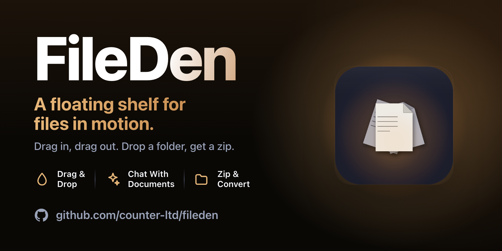
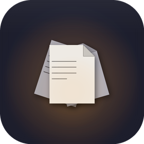

<div align="center">



<br>


<br><br>



# FileDen

**A floating shelf for the files you're working with right now.**


[](LICENSE.md)

`drag · drop · stash · share`

</div>

---

> Inspired by Yoink and FilePane. Built because the macOS desktop is not a staging area, the dock is not a clipboard, and a shelf you can summon anywhere shouldn't cost $10.

---

## What it is

FileDen is a tiny floating window — a "den" — that holds files while you move them between apps, archives, uploads, and conversations. Drag in. Drag out. Drop a folder, get a zip. Shake your mouse, get a fresh den near the cursor. Hit a hotkey, same. Close it, the contents go to recents.

Built in Swift + AppKit + SwiftUI for macOS 14+. No Electron, no background daemons, no telemetry.

---

## Highlights

- **Multiple dens.** Spawn as many as you want — each is independent.
- **Drag-out as multi-file.** One drag carries the whole stack.
- **Smart actions menu.** Open, Quick Look, Reveal, Copy, Duplicate, Copy Path, Compress to ZIP, Unarchive, Print, Set as Wallpaper, Combine to PDF, Share, Move to Trash — surfaced based on file type.
- **PDF tools.** Select PDFs and a *PDF Tools* submenu appears: merge, split into pages, export pages as images, extract embedded images, extract text. Results land in a fresh den, staged for you to drag wherever they belong.
- **Notch drop.** Drag onto the notch (or its area on non-notch Macs) to open a fresh den below it.
- **Mouse-shake to summon.** Wiggle the cursor; a new den appears near it.
- **Global hotkey.** Default ⌥⇧D, fully rebindable.
- **Recents.** Closed dens remember what was in them.
- **Auto-zip folders on share.** Optional. Toggleable.

---

## The den

A den has two modes:

| Mode | Behavior |
|------|----------|
| **Compact** | 200×200, dashed drop zone when empty, file thumbnail / stacked cards when full. Bottom-right action button. |
| **Expanded** | 340×420, grid or list view of all items, multi-select with ⌘/⇧/⌃-click, contextual share label, actions button. |

Tap the file/stack to expand. Chevron back to collapse. The window floats above other apps and follows you across spaces.

---

## Spawning a den

There are four ways to get a new den on screen:

1. **Menu bar icon** → click → **New Den**.
2. **Global hotkey** (default ⌥⇧D). Configure in Settings.
3. **Mouse shake**. Wiggle the cursor in tight strokes. Toggleable in Settings.
4. **Drag files onto the notch** (or the screen-top center on Macs without one).

The shortcut shown in the menu auto-mirrors whatever is configured. Disable the hotkey and the menu shortcut disappears too.

---

## Actions menu

The actions button (•••) replaces the share button and adapts to selection:

- Always: Open, Quick Look, Reveal in Finder, Copy, Duplicate, Copy Path, Share…, Move to Trash.
- Folders or multiple items → **Compress to ZIP**.
- All archives → **Unarchive**.
- All printable (pdf/img/txt/rtf) → **Print**.
- All images → **Set as Wallpaper**, **Combine to PDF**.
- All PDFs → **PDF Tools** ▸ Merge PDFs (2+), Split into Pages, Export Pages as Images, Extract Images, Extract Text.

PDF tools run natively (PDFKit + CoreGraphics, no external binaries). Output is staged into a new den — nothing is written next to your originals until you drag it there.

In the expanded view, the button label reflects context: *Actions*, *Actions: filename*, or *Actions (N)*.

---

## Privacy

Everything stays local. No network calls, no analytics, no crash-reporters. Recent dens live in `~/Library/Application Support/FileDen`. Settings are in `UserDefaults`. Wipe with `make reset`.

---

## Building

Requires **macOS 14+, Swift 5.10, Xcode CLT**.

```bash
make build      # size-optimised release build (-Osize, -wmo, -dead_strip)
make bundle     # assemble FileDen.app under build/ (strips symbols, ad-hoc signs)
make run        # bundle + launch
make release    # clean + bundle, ready to ship
make debug      # debug build + run in foreground
make icon       # rebuild AppIcon.icns
make clean      # clear SwiftPM + build/
make reset      # wipe ~/Library/Application Support/FileDen
```

The release bundle ships at ~1.2 MB on Apple Silicon — most of which is the icon.

Codesigning uses an ad-hoc signature (`codesign --sign -`). For distribution you'll want a Developer ID; swap the signing identity in the `Makefile`.

---

## Releases

Tagged off `main`. Build → bundle → notarize → DMG → attach to GitHub release. No auto-update channel; bring-your-own.
