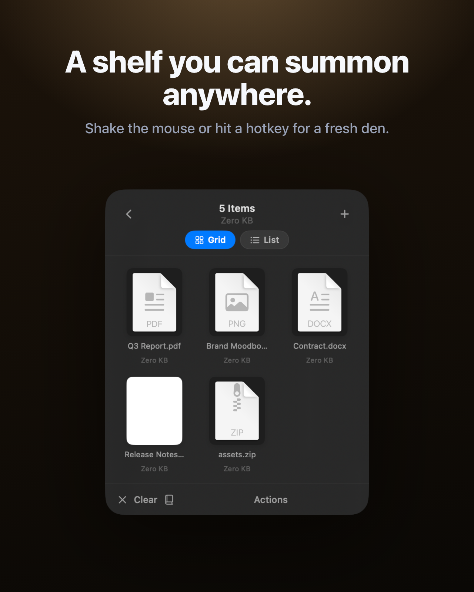
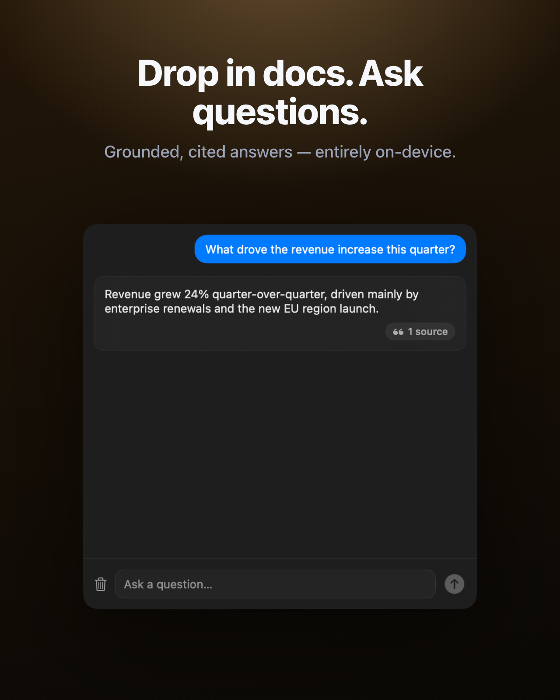

<div align="center">


<br>


<br><br>


# FileMaster

**A floating shelf for the files you're working with right now.**


[](LICENSE.md)


`drag · drop · stash · ask · share`

</div>

---

> Inspired by [Yoink](https://apps.apple.com/gb/app/yoink-improved-drag-and-drop/id457622435) and [FilePane](https://apps.apple.com/gb/app/filepane/id846781299) — the macOS desktop is not a staging area, the dock is not a clipboard, and a shelf you can summon anywhere shouldn't cost £10.

---

## Get the compiled binary

A signed, notarized build is available for purchase at **[anti.ltd/filemaster](https://anti.ltd/filemaster)**.

Use discount code **`READTHESOURCE`** at checkout for a discount — because you found the source.

---

## Screenshots

<div align="center">
 
</div>

<div align="center">
 
</div>

<div align="center">
 
</div>

---

## Performance

<div align="center">

</div>

> Generated by `make screenshot` or `appstage art filemaster` using [App-arently](../app-arently).

---

## What it is

FileMaster is a tiny floating window — a **den** — that holds files while you move them between apps, archives, uploads, and conversations. Drag in. Drag out. Drop a folder, get a zip. Shake your mouse, get a fresh den near the cursor. Hit a hotkey, same. Close it, the contents go to recents.

The den also reads what you drop into it. Toss in PDFs, Word, Markdown, text or source code, hit **Ask**, and have a multi-turn conversation about them with cited answers — entirely on this Mac. And it edits: open any image into a full editor inside the den — adjustments, filters, crop, markup, redaction, background removal — without ever leaving the window.

Built in Swift, AppKit and SwiftUI for macOS 14+. No Electron, no helper processes, no background daemons. Document Q&A and image editing both run on Apple's on-device frameworks.

---

## Four ways to summon a den

| Trigger | Behaviour |
|---|---|
| **Menu-bar icon → New Den** | Always available. |
| **Global hotkey** | Default ⌥⇧D, rebindable in *Settings*. The shortcut in the menu auto-mirrors whatever is configured; turn the hotkey off and it disappears. |
| **Mouse shake** | Wiggle the cursor in tight strokes — a fresh den snaps open near it. Toggleable. |
| **Notch drop** | Drag files onto the notch (or the screen-top centre on non-notch Macs) and a den opens below it. |

A den floats above other apps and follows you across spaces.

---

## The den

| Mode | Behaviour |
|------|----------|
| **Compact** (200×200) | Dashed drop zone when empty, file thumbnail / stacked cards when full. Action button bottom-right. |
| **Expanded** (340×420) | Grid or list of every item. Multi-select with ⌘ / ⇧ / ⌃-click. |
| **Ask** | A side-by-side split — files on the left, a chat about them on the right. Click a citation to open a third pane with the source passage highlighted. |
| **Edit** | A three-pane image editor — files on the left (also acting as image tabs), the live canvas in the middle, tool controls on the right. |

Tap the file/stack to expand. Chevron back to collapse.

---

## Actions menu

The •••  button replaces the share button and adapts to selection (or every item, when nothing is selected):

- **Always:** Open, Quick Look, Reveal in Finder, Copy, Duplicate, Copy Path, Share…, Move to Trash.
- **Any searchable document** (PDF / Word / Markdown / text / code / …) → **Ask AI…** — opens the inline chat.
- **Folders or multiple items** → **Compress to ZIP**.
- **All archives** → **Unarchive**.
- **All printable** (pdf / image / txt / rtf) → **Print**.
- **All images** → **Set as Wallpaper**, **Combine to PDF**, **Convert Image** ▸ JPEG / HEIC / PNG / TIFF / WebP / AVIF (the last two surface only where the OS can encode them), plus **Resize…** and **Compress Image…**. Animated GIFs also get **To Video (MP4)**.
- **A single image** → **Edit Image…** — opens the full inline image editor.
- **All PDFs** → **PDF Tools** ▸ Merge, Split into Pages, Export Pages as Images, Extract Images, Extract Text.
- **All videos** → **Convert Video** ▸ HEVC (smaller), MP4, MOV, GIF, Poster Frame, Extract Audio.

All operations run natively (PDFKit, CoreGraphics, ImageIO, AVFoundation — no external binaries). Lossy targets use a near-1.0 quality; lossless targets are exact; video container changes rewrap losslessly when the codec allows. Long jobs show a floating progress HUD; output stages into a new den so nothing is written next to your originals until you drag it there.

---

## Ask: chat about your documents

Drop documents into a den, hit **Ask**, and have a conversation about them — on this Mac, no API keys, no subscription.

- **Multi-turn chat**, grounded in your own documents. Follow-ups keep the thread.
- **Many formats:** PDF (with on-device OCR for scanned pages), Word (`.docx`), RTF, HTML, Markdown, plain text, CSV / TSV, JSON / YAML / TOML / INI, source code.
- **Hybrid retrieval.** Semantic search (Apple's `NLContextualEmbedding`) is fused with BM25 keyword search (SQLite FTS5) so the chat catches both meaning *and* exact names, IDs, codes and figures. Vectors are pre-normalised and scored with a single Accelerate matrix multiply — search is sub-second after indexing.
- **Cited, clickable sources.** Every answer carries a *sources* chip; click a source to open it in a third pane — PDFs jump to the page with the passage highlighted, text / Markdown / HTML / RTF / DOCX scroll to the highlighted span. One window holds everything.
- **Calculator tool.** The model can call a calculator for exact arithmetic, so "total revenue" returns the right number instead of a guess.
- **No dead ends.** If Apple Intelligence is unavailable (older Mac, switched off, or the model declines), Ask falls back to the matched passages with the same citations.
- **Notebooks.** Save a set of documents as a named notebook and reopen it from the menu bar to ask it again. Indexes are cached.

Open it from **Ask AI…** in a den's actions menu, the sparkle button on a compact den, or by opening a saved **Notebook** from the menu bar. Toggle the whole feature, or "passages-only", in **Settings → AI**.

**Requirements.** Indexing, retrieval, OCR and passage search run on macOS 14+. Written prose answers use Apple's Foundation Models — macOS 26 with Apple Intelligence enabled. The framework is weak-linked, so FileMaster still launches on every Mac.

**Bring your own LLM.** *Settings → AI* also offers **OpenAI**, **Ollama** (`localhost:11434`) and **llama.cpp** (`localhost:8080`) as providers. They're off by default and only fire when you select one and supply the base URL / model / key. Picking one means the question and the matched passages are sent to that endpoint; the default (Apple Intelligence) never leaves the Mac.

---

## Image editor

Open any image into a full editor inside the den — no separate app, no upload. Three panes: files on the left (doubling as image **tabs** — click another image to switch, each keeps its own edits), the live canvas in the middle, the tool controls on the right. GPU-accelerated through Core Image + Metal; adjustments preview in real time, CPU stays idle when you're not dragging.

- **Adjust.** Exposure, brightness, contrast, saturation, vibrance, warmth, highlights, shadows, sharpness — click any value to reset it.
- **Filters.** One-tap looks (Mono, Noir, Fade, Chrome, Instant, Process, Transfer, Sepia), shown as live thumbnails of your own image.
- **Crop & geometry.** Interactive crop with a rule-of-thirds grid and aspect presets (Free / 1:1 / 4:3 / 3:2 / 16:9 / 9:16), 90° rotate, flip, fine straighten.
- **Markup.** Freehand pen, line, arrow, box, oval, highlighter, text — pick a colour and thickness. Drawn vector-clean and baked in only on export.
- **Redaction.** Blackout or pixelate any region; redactions are burned into the pixels, so they can't be peeled back off the exported file.
- **Background removal.** One-tap on-device subject isolation via the Vision foreground-mask API, straight onto transparency.
- **Undo / redo** the full edit history, or reset to the original in one click.
- **Export** to a new den in any format (PNG / JPEG / HEIC / TIFF / WebP / AVIF) with quality and scale — or **Overwrite Original** (behind a confirmation) to replace the file in place, keeping its format.

Open from **Edit Image…** in a den's actions menu, or the wand button on a compact den.

---

## Recents

Closing a den remembers what was in it. Re-open from the menu bar's **Recents** submenu and a fresh den repopulates with the same items.

---

## How it works

| File | Role |
|------|------|
| [`FileMasterApp.swift`](Sources/FileMaster/FileMasterApp.swift) | `@main` entrypoint, scene declaration |
| [`AppDelegate.swift`](Sources/FileMasterUI/AppDelegate.swift) | Menu-bar item, lifecycle, activation policy |
| [`DenManager.swift`](Sources/FileMasterUI/DenManager.swift) | Den spawning, positioning, lifecycle |
| [`Views/ShelfView.swift`](Sources/FileMasterUI/Views/ShelfView.swift) | Compact / expanded / Ask / Edit modes |
| [`Views/ActionsMenu.swift`](Sources/FileMasterUI/Views/ActionsMenu.swift) | Per-selection actions surfacing |
| [`PDFTools.swift`](Sources/FileMasterUI/PDFTools.swift) | Merge / split / extract pages, text and images |
| [`MediaTools.swift`](Sources/FileMasterUI/MediaTools.swift) | Image + video conversion (ImageIO / AVFoundation) |
| [`Staging.swift`](Sources/FileMasterUI/Staging.swift) | Output staging into `~/Library/Application Support/…/Staging` |
| [`GlobalShortcutManager.swift`](Sources/FileMasterUI/GlobalShortcutManager.swift) | Global hotkey monitor (`CGEventTap`) |
| [`ShakeDetector.swift`](Sources/FileMasterUI/ShakeDetector.swift) | Mouse-shake summon |
| [`NotchDropController.swift`](Sources/FileMasterUI/NotchDropController.swift) | Notch-drop activation |
| [`ProgressHUD.swift`](Sources/FileMasterUI/ProgressHUD.swift) | Stacking floating progress HUD for long jobs |
| [`ImageEditor/ImageEditEngine.swift`](Sources/FileMasterUI/ImageEditor/ImageEditEngine.swift) | Core Image + Metal pipeline |
| [`ImageEditor/AnnotationBaker.swift`](Sources/FileMasterUI/ImageEditor/AnnotationBaker.swift) | Markup → pixels on export |
| [`AskEngine.swift`](Sources/FileMasterAI/AskEngine.swift) | Extraction → chunking → embedding → indexing |
| [`Chat/DocumentChat.swift`](Sources/FileMasterAI/Chat/DocumentChat.swift) | Multi-turn Q&A with citation handling |
| [`Embedding/ContextualEmbeddingProvider.swift`](Sources/FileMasterAI/Embedding/ContextualEmbeddingProvider.swift) | `NLContextualEmbedding` wrapper |
| [`Store/SQLiteIndexStore.swift`](Sources/FileMasterAI/Store/SQLiteIndexStore.swift) | SQLite + FTS5, vector blobs |
| [`Generation/LLMConfiguration.swift`](Sources/FileMasterAI/Generation/LLMConfiguration.swift) | Apple Intelligence + BYO providers |
| [`UpdateChecker.swift`](Sources/FileMasterCore/UpdateChecker.swift) | Manual "Check for updates" plumbing |
| [`Paths.swift`](Sources/FileMasterCore/Paths.swift) | App-support directory layout |

---

## Privacy

FileMaster needs the macOS **Accessibility** permission for the global hotkey and mouse-shake — those need a system-wide event tap. Files you drop in are accessed only while a den holds them.

**What stays on this Mac**

- Settings and the recents list — `UserDefaults`.
- Tool outputs (PDF ops, image / video conversions, archives) — staged under `~/Library/Application Support/counter-ltd/filemaster/Staging` and cleared at launch.
- Ask's search indexes — `…/Indices`. Saved notebooks — `…/Notebooks`. Clear indexes from *Settings → AI*; wipe everything with `make reset`.
- The Ask chat under the default Apple Intelligence provider — extraction, OCR, embeddings, retrieval, and the written answer all run on Apple's on-device frameworks (`NaturalLanguage`, `Vision`, `FoundationModels`). No document text, no questions, and no answers ever leave the Mac.

**What leaves the Mac, and only when you ask for it**

- **Check for updates** (in *About*) — one GET to `https://anti.ltd/api/version?app=filemaster`. No identifiers, no payload, no headers beyond `Accept: application/json`.
- **BYO LLM providers** (OpenAI / Ollama / llama.cpp) — off by default. If you select one in *Settings → AI* and configure a base URL / model / key, the question and the matched passages are sent to that endpoint on every chat turn. The localhost providers (Ollama / llama.cpp) of course stay local, but as far as FileMaster is concerned they're a network call.

No analytics, no crash reporters, no telemetry. The MAS build declares `com.apple.security.network.client` solely to allow the two user-initiated paths above.

---

## Building

Requires **macOS 14+**, **Swift 5.10**, and the Xcode command-line tools.

FileMaster depends on **[iUX-MacOS](../iUX-MacOS)** — our shared UX layer (settings popover shell, menu-bar host, overlay windows) — via a local path (`../iUX-MacOS`). Check it out as a sibling directory before building:

```
Projects/
├── filemaster/  ← this repo
└── iUX-MacOS/   ← shared macOS UX library
```

```bash
git clone git@github.com:anti-ltd/iUX-MacOS.git ../iUX-MacOS   # one-time

make run        # build, bundle, launch
make bundle     # assemble FileMaster.app under build/
make build      # just compile the release binary
make icon       # rebuild AppIcon.icns from the procedural renderer
make test       # swift test
make dmg        # drag-to-install disk image of the local bundle (testing only)
make build-mas  # Mac App Store .pkg (bumps build #; pass NO_BUMP=1 to skip)
make dist       # Developer ID + hardened-runtime + notarize + staple + DMG + manifest
make reset      # wipe ~/Library/Application Support/counter-ltd/filemaster
make clean      # remove .build/ and build/
```

There are no third-party dependencies — everything is built on system frameworks (AppKit, SwiftUI, PDFKit, AVFoundation, ImageIO, Core Image + Metal, plus NaturalLanguage, Accelerate, Vision, SQLite, and a weak-linked FoundationModels for Ask).

Codesigning uses a local `FileMaster Dev` code-signing certificate if one exists in your keychain, otherwise it falls back to ad-hoc.

FileMaster needs Accessibility access for the global hotkey and mouse-shake. macOS ties that grant to the app's signing identity, and an ad-hoc signature changes on every rebuild — so you'd have to re-grant after each build. To make the grant stick, create a reusable self-signed `FileMaster Dev` certificate once (Keychain Access → Certificate Assistant → Create a Certificate → type *Code Signing*); `make bundle` / `make run` pick it up automatically.
